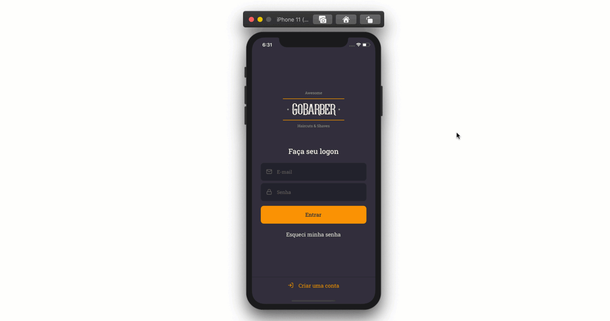

  

### Sobre:

O **GoBarber** é uma plataforma WEB e MOBILE para agendamentos de serviços de barbearia.

A versão **mobile** é destinado aos clientes das barbearias e está disponível para Android e iOS. :iphone:

### Ferramentas, Técnicas e Bibliotecas da API:

- [x] Utilização do [react-native-iphone-x-helper](https://github.com/ptelad/react-native-iphone-x-helper) para pegar informações de tela de iphonex para facilitar a elaboração de layout;
- [x] Utilização do [Unform](https://unform.dev/) para lidar com formulários;
- [x] Utilização do [Yup](https://github.com/jquense/yup) para validação de dados;
- [x] Utilização da biblioteca [datetimepicker](https://github.com/react-native-community/datetimepicker) para selecionar data e hora para agendamentos;
- [x] Utilização da biblioteca [react-native-image-picker](https://github.com/react-native-community/react-native-image-picker) para acessar a câmera para tirar uma foto ou selecionar uma foto existente da galeria de imagens;
- [x] Utilização do repositório [Avatars.adorable.io](http://avatars.adorable.io/) para utilizar imagens quando a pessoa não tem um foto definida;
- [x] Utilização do [Flipper](https://fbflipper.com/) para debugar a aplicação;
- [x] Utilização da biblioteca [react native testing library](https://github.com/callstack/react-native-testing-library) para testes;
- [ ] Sugestão para aplicar a biblioteca [ImageEditor](https://github.com/react-native-community/react-native-image-editor) para reduzir o tamanho e compactar a imagem de avatar do usuário.

  <small>Rodrigo Gonçalves Santana - 2020</small>

